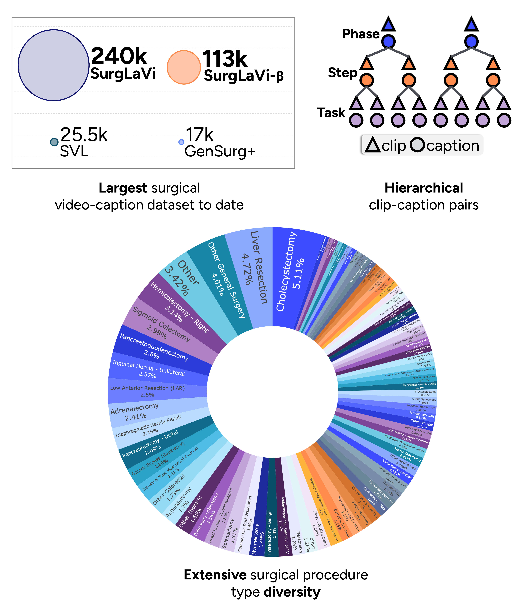
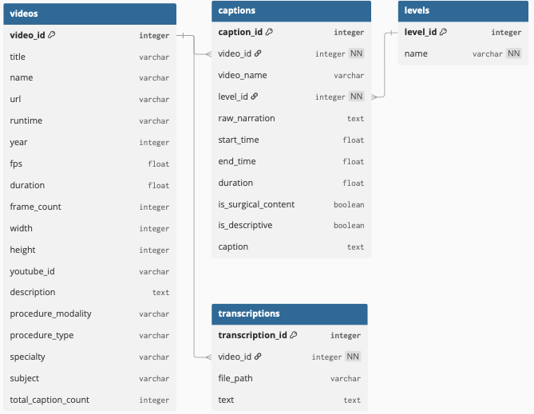
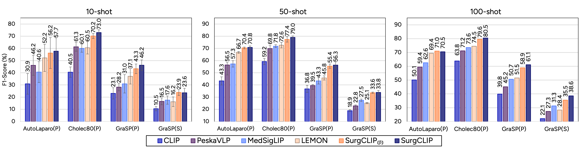

# SurgLaVi: Large-Scale Hierarchical Dataset for Surgical Vision-Language Representation Learning 

Alejandra Perez<sup>1,2,*</sup>, Chinedu Nwoye<sup>1</sup>, Ramtin Raji Kermani<sup>1</sup>, Omid Mohareri<sup>1</sup>, Muhammad Abdullah Jamal<sup>1</sup>

<sup>1</sup> Intuitive Surgical Inc., CA.  
<sup>2</sup> Center for Research and Formation in Artificial Intelligence (CinfonIA), Universidad de los Andes, Colombia.  
<sup>*</sup> Work done during an internship at Intuitive Surgical Inc.  

[](https://arxiv.org/abs/2509.10555)
[](https://huggingface.co/datasets/aleperez24/SurgLaVi)

## Abstract


**Vision–language pre-training (VLP)** offers unique advantages for surgery by **aligning language with surgical videos**, enabling workflow understanding and **transfer** across tasks without relying on expert-labeled datasets. However, progress in surgical VLP remains constrained by the limited scale, procedural diversity, semantic quality, and hierarchical structure of existing datasets. In this work, we present **SurgLaVi**, the largest and most diverse surgical vision–language dataset to date, comprising nearly 240k clip–caption pairs from more than 200 procedures, and comprising hierarchical levels at phase-, step-, and task-level. At the core of SurgLaVi lies a fully automated pipeline that systematically generates fine-grained transcriptions of surgical videos and segments them into coherent procedural units. To ensure high-quality annotations, it applies dual-modality filtering to remove irrelevant and noisy samples. Within this framework, the resulting **captions are enriched with contextual detail, producing annotations that are both semantically rich and easy to interpret**. To ensure accessibility, **we release SurgLaVi-β**, an open-source derivative of ~113k clip–caption pairs constructed entirely from public data, which is over **four times larger** than existing surgical VLP datasets. To demonstrate the value of SurgLaVi datasets, we introduce **SurgCLIP**, a CLIP-style video–text contrastive framework with dual encoders, as a representative base model. **SurgCLIP achieves consistent improvements across phase, step, action, and tool recognition, surpassing prior state-of-the-art methods**, often by large margins. These results validate that **large-scale, semantically rich, and hierarchically structured datasets** directly translate into stronger and more **generalizable representations**, establishing SurgLaVi as a key resource for developing surgical foundation models. 


***Key features of SurgLaVi on scale, workflow structure, and surgical procedure diversity:***
 


## Download Instructions

### Step 1: Download the database and transcription files from either of these sources

- [Google Drive](https://drive.google.com/drive/folders/1gwaGfaRiG_QhABCp43uZJ4CqNEC0R_hc?usp=sharing)  
- [Hugging Face 🤗](https://huggingface.co/datasets/aleperez24/SurgLaVi)
  
Extract the contents to the `data/` directory in your project.

### Step 2: Get YouTube cookies
To download videos that require YouTube login, you need to provide a cookies.txt file. Instructions to generate it are found [here](https://github.com/yt-dlp/yt-dlp/wiki/FAQ#how-do-i-pass-cookies-to-yt-dlp)

### Step 3: Download Videos

Use the provided script to download the actual video files:

```bash
# Install dependencies
pip install -r requirements.txt

# Download videos using the metadata database
python src/video_downloader.py --db ./data/surglavi_beta.db --o ./data/videos -c /path/to/cookies.txt

# Optional: Extract frames to load them directly for a faster, more flexible, and resource-efficient training
python src/frame_extraction.py --root_dir ./data/videos --temp_dir data/temp_frames --output_dir ./data/frames --workers 8
```

The frame extraction script saves frames in a highly compressed format to minimize storage requirements. 

## Data Structure

### Database Schema (SQL)

The SurgLaVi-β Database is organized in a SQL schema that links videos, captions from different levels, and transcriptions, making it easy to query subsets and keep samples correlated. It includes 6,812 source videos, of which 3,148 are narrated (we include narrated and silent material). Alongside curated captions, the database provides raw captions with filtering flags, full transcriptions, and video metadata, so researchers can work with the final dataset and also intermediate results from our [data processing pipeline](assets/pipeline.png). Exploratory statistics and visualizations are available in the [explorer notebook](src/surglavi_explorer.ipynb)



## Project Structure

```
surglavi/
├── README.md
├── LICENSE
├── requirements.txt
├── setup.py
├── data/
│   ├── surglavi_beta.db           # SQLite database with metadata
│   ├── transcriptions/            # Transcription files (Optional)
│   ├── videos/                    # Videos
│   └── frames/                    # Extracted video frames (Optional)
├── src/
│   ├── video_downloader.py            # Download videos from source
│   ├── frame_extraction.py            # Extract and compress frames
│   ├── dataloader.py                  # PyTorch data loader
│   ├── cc_explore_utils.py            # Notebook utils
│   └── surglavi_explorer.ipynb        # Data exploration notebook
```


## Usage

### Data exploration
Explore SurgLaVi using our interactive [Jupyter notebook](src/surglavi_explorer.ipynb). 


### Basic Data Loading
We provide a basic [dataloader](src/dataloader.py) that returns a random tensor as a video clip, so you can try it out without downloading the videos. For real data, you can customize the `_load_video_clip` function to load videos and extract clips using start/end timestamps or read clip frames directly from previously extracted frame files.

```python
from src.dataloader import SurgLaViDataset
from torch.utils.data import DataLoader

# Initialize dataset
dataset = SurgLaViDataset(
    db_path='data/surglavi_beta.db',
    video_root='data/videos',
    num_frames = 16,
    filter_pairs = True,
    enhanced_captions = True,
    text_preprocess = True, 
    level_ids = [1, 2, 3],
    max_duration = 500
)

print(dataset.get_stats())

# Create data loader
dataloader = DataLoader(
    dataset, 
    batch_size=8, 
    shuffle=True, 
)

# Iterate through data
for batch in dataloader:
    clips, captions, index = batch
```

## SurgCLIP
To show the value of the SurgLaVi, we introduce SurgCLIP, a CLIP-style video–text model with dual encoders. SurgCLIP outperforms previous methods on phase, step, action, and tool recognition, showing that large and well-structured datasets like SurgLaVi lead to stronger and more generalizable representations.

### Zero-shot performance comparison

**Comparison across multiple surgical benchmarks covering different procedure types, modalities, and task granularities.**  
We evaluate phase, step, action, and tool recognition using accuracy (Acc), F1-score (F1), and mean average precision (mAP).  
- **SurgCLIP** is trained on the full SurgLaVi dataset.  
- **SurgCLIP (β)** is trained on the open-source SurgLaVi-β subset (the released version).  

| Model           | Cholec80 (Acc/F1) | AutoLaparo (Acc/F1) | StrasBypass70 (Acc/F1) | BernBypass70 (Acc/F1) | GraSP Phase (Acc/F1) | GraSP Step (Acc/F1) | SARRARP50 (Acc/F1) | CholeT50 (mAP) | Cholec80 Tool (mAP) | GraSP Tool (mAP) |
|-----------------|-------------------|----------------------|-------------------------|------------------------|-----------------------|---------------------|---------------------|----------------|----------------------|------------------|
| CLIP            | 27.81 / 8.42     | 8.02 / 4.79         | 18.52 / 3.51           | 20.73 / 4.17           | 9.93 / 2.06          | 3.85 / 0.83         | **28.80 / 6.28**   | 2.50           | 18.44               | 36.00           |
| MedSigLIP       | 40.94 / 18.74    | 26.54 / 10.17       | 20.15 / 5.54           | 30.73 / 6.14           | 12.88 / 4.84         | 11.53 / 1.86        | 5.49 / 3.17        | 2.98           | 17.92               | 37.18           |
| SurgVLP         | 49.02 / 32.46    | 10.02 / 7.19        | 26.08 / 19.18          | 30.46 / 17.48          | 11.79 / 6.07         | 6.02 / 3.22         | 17.91 / 7.03       | 3.04           | 31.19               | 36.93           |
| HecVL           | 47.50 / 23.89    | 38.72 / 25.81       | 28.59 / 23.91          | **32.09 / 18.58**      | 10.99 / 6.46         | 1.96 / 0.56         | 4.67 / 3.03        | 3.63           | 25.11               | 36.75           |
| PeskaVLP        | 51.43 / 39.39    | 34.94 / 28.41       | 29.42 / 19.64          | 31.48 / 17.47          | 13.85 / 9.86         | 3.65 / 2.47         | 5.18 / 2.68        | **4.49**       | **38.88**           | 41.05           |
| **SurgCLIP (β)**| 57.98 / 39.42    | 55.72 / 45.95       | 31.24 / 26.05          | 18.30 / 15.06          | 34.77 / 27.98        | 14.15 / 11.14       | 13.94 / 7.62       | 4.17           | 36.77               | 43.06           |
| **SurgCLIP**    | **61.29 / 50.53**| **69.14 / 56.37**   | **32.37 / 30.78**      | 23.90 / **19.68**      | **41.49 / 34.94**    | **26.28 / 16.53**   | 17.42 / **7.76**   | 5.28           | 40.80               | **45.97**       |

### Linear probing performance comparison
To further evaluate representation quality, we also perform **linear probing**.  
The figure below shows comparative F1-scores for *N*-shot linear probing across phase (P) and step (S) recognition tasks.  
Here, *N* indicates the percentage of training procedures used, and (β) marks models trained on the SurgLaVi-β subset.  

  
*Comparative linear probing performance. F1-scores are reported for SurgCLIP and prior state-of-the-art models.*  


## License  

This dataset is released under the [Creative Commons Attribution-NonCommercial-ShareAlike 4.0 International License (CC BY-NC-SA 4.0)](https://creativecommons.org/licenses/by-nc-sa/4.0/).  


## Acknowledgements  

We gratefully acknowledge prior work on YouTube surgical video scrapping, which supported the development of this dataset.  

- Schmidgall, S., Kim, J. W., Jopling, J., & Krieger, A. (2024). *General surgery vision transformer: A video pre-trained foundation model for general surgery.* arXiv preprint [arXiv:2403.05949](https://arxiv.org/abs/2403.05949).  
- Che, C., Wang, C., Vercauteren, T., Tsoka, S., & Garcia-Peraza-Herrera, L. C. (2025). *LEMON: A Large Endoscopic MONocular Dataset and Foundation Model for Perception in Surgical Settings.* arXiv preprint [arXiv:2503.19740](https://arxiv.org/abs/2503.19740).  


## 📚 Citation

If you find **SurgLaVi** useful for your research, please cite our work:

```bibtex
@misc{perez2025surglavi,
      title={SurgLaVi: Large-Scale Hierarchical Dataset for Surgical Vision-Language Representation Learning}, 
      author={Alejandra Perez and Chinedu Nwoye and Ramtin Raji Kermani and Omid Mohareri and Muhammad Abdullah Jamal},
      year={2025},
      eprint={2509.10555},
      archivePrefix={arXiv},
      primaryClass={cs.CV},
      url={https://arxiv.org/abs/2509.10555}, 
}
```
